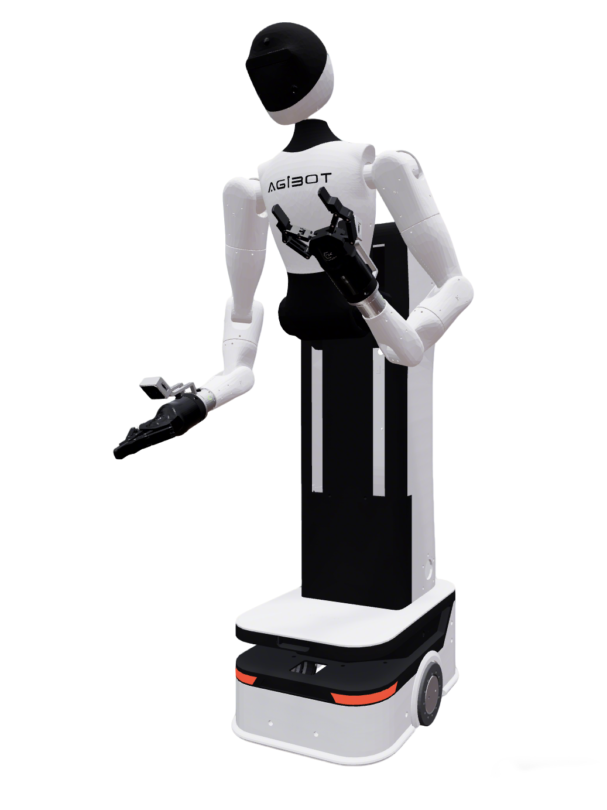
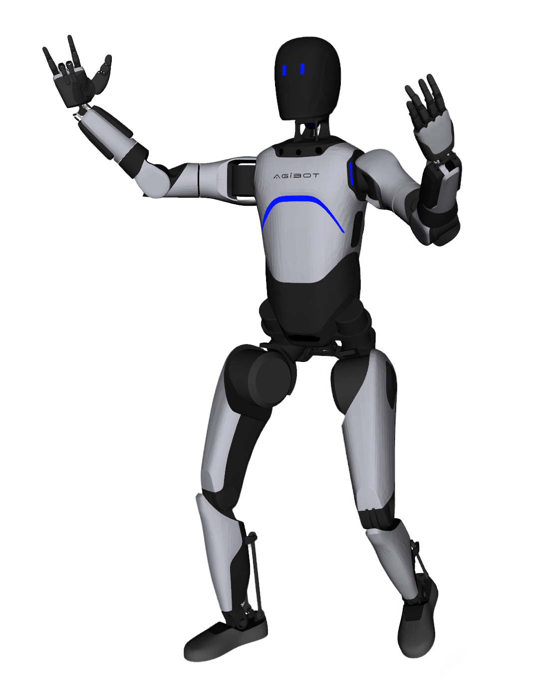
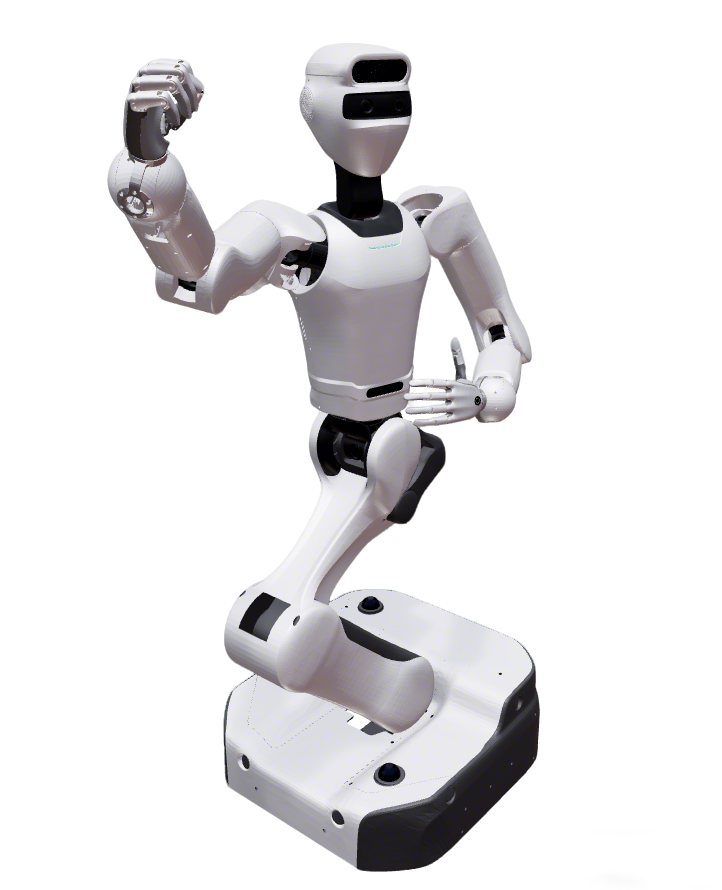

# Robot Descriptions

This repository contains the URDF files for humanoid and manipulator robots, all organized as ROS2 packages. Most of them have been repainted in Blender for better visualization. ☺️

> **Note**: Quadruped robot descriptions are now managed as a separate submodule. See the [Submodules](#submodules) section below.

## Quick Start

```bash
# Clone the repository
git clone https://github.com/fiveages-sim/robot_descriptions

# Navigate to the repository directory
cd robot_descriptions

# Initialize and update all submodules
git submodule init
git submodule update
```

Or clone the repository with all submodules in one command:

```bash
git clone --recursive https://github.com/fiveages-sim/robot_descriptions
```

> **Note**: This repository uses git submodules. Make sure to initialize them to access all robot descriptions and components. See the [Submodules](#submodules) section below for details.

## Humanoid Robots

| Brand    | Model                                                | Repaint | Images                                                                                                                                                                                                                   |
|----------|------------------------------------------------------|---------|--------------------------------------------------------------------------------------------------------------------------------------------------------------------------------------------------------------------------|
| Booster  | [T1](humanoid/Booster/t1_description/)               | Yes     |                                                                                                               |
| EngineAI | [SA01](humanoid/EngineAI/sa01_description/)          | Yes     |                                                                                                            |
| EngineAI | [PM01](humanoid/EngineAI/pm01_description/)          | Yes     |                                                                                                            |
| RobotEra | [xbot](humanoid/RobotEra/xbot_description)           | Yes     |                                                                                                                                                                |
| Agibot   | [G1](humanoid/Agibot/agibot_g1_description)          | No      |                                                                                                                                                             |
| Agibot   | [A2](humanoid/Agibot/agibot_a2_description)          | Yes     |                                                                                                                                                             |
| Airbot   | [MMK2](humanoid/Airbot/airbot_mmk2_description)      | Yes     |                                                                                                                                                                  |
| Astribot | [S1](humanoid/Astribot/astribot_s1_description)      | Yes     |                                                                                                                                                            |
| Galaxea  | [R1](humanoid/Galaxea/galaxea_r1_description)        | Yes     |                                                                                                       |
| Galaxea  | [R1 Pro](humanoid/Galaxea/galaxea_r1pro_description) | Yes     |                                                                                                                                                               |
| ARX      | [LIFT](humanoid/ARX/arx_lift_description)            | Yes     |       |
| ARX      | [X7S](humanoid/ARX/arx_x7s_description)                  | Yes     |                                                                                                                                                                      |
| Realman  | [AIDAL](humanoid/Realman/aidal_description)          | Yes     |                                                                                                                                                                |
| Unitree  | [G1](humanoid/Unitree/unitree_g1_description)        | Yes     |                                                                                                                                                                   |

## Manipulator Robots

| Brand          | Model                                                       | Repaint | Images                                                                                                                                                                                                                                                                                                                                                                                |
|----------------|-------------------------------------------------------------|---------|---------------------------------------------------------------------------------------------------------------------------------------------------------------------------------------------------------------------------------------------------------------------------------------------------------------------------------------------------------------------------------------|
| TheRobotStudio | [SO-ARM](manipulator/LeRobot/so_arm_description)            | Yes     |                                                                                                                                           |
| SIGRobotics    | [Lekiwi](manipulator/LeRobot/lekiwi_description)            | Yes     |                                                                                                                                 |
| ARX            | [X5/R5](manipulator/ARX/arx5_description)                   | Yes     |                                                                                                                                                                                                                                                                           |
| AgileX         | [Piper](manipulator/AgileX/piper_description)               | Yes     |                                                                                                                      |
| AgileX         | [AgileX Aloha](manipulator/AgileX/agilex_aloha_description) | Yes     |                                                                                                                                                                                                                                                        |
| Galaxea        | [A1/A1X/A1Y](manipulator/Galaxea/galaxea_a1_description)    | Yes     |    |
| Galaxea        | [R1 Lite](manipulator/Galaxea/galaxea_r1lite_description)   | Yes     |                                                                                                                                               |
| Airbots        | [Play](manipulator/Airbot/airbot_play_description)          | Yes     |                                                                                                                                                                                                                                                                                                                            |
| Realman        | [RM65](manipulator/Realman/rm65_description)                | Yes     |                                                                                                                                                                                                                                                                                                                           |
| Elite          | [EC Series](manipulator/Elite/elite_ec_description)         | Yes     |                                                                                                                                                                                                                                                                                                                             |
| OpenArm        | [OpenArm](manipulator/OpenArm/openarm_description)          | Yes     |                                                                                                                                                 |

## Submodules

This repository uses git submodules to manage shared components and specific robot descriptions independently:

| Name | Path | Repository | Description |
|------|------|------------|-------------|
| Common Components | `common` | [robot-descriptions-common](https://github.com/fiveages-sim/robot-descriptions-common) | Shared grippers, dexterous hands, camera models, and launch utilities |
| Quadruped Robots | `quadruped` | [robot-descriptions-quadruped](https://github.com/fiveages-sim/robot-descriptions-quadruped) | Quadruped robot descriptions including Unitree, Deep Robotics, MagicLab, and ZsiBot |
| Dobot CR5 | `manipulator/Dobot` | [robot-descriptions-dobot](https://github.com/fiveages-sim/robot-descriptions-dobot) | 6-DOF collaborative robot arm with real hardware integration |
| Tianji M6 | `manipulator/Tianji` | [robot-descriptions-tianji](https://github.com/fiveages-sim/robot-descriptions-tianji) | M6-CCS and M6-SRS manipulator arms |
| Rokae AR5 | `manipulator/Rokae` | [robot-descriptions-rokae](https://github.com/fiveages-sim/robot-descriptions-rokae) | 6-DOF industrial robot arm |

### Using Submodules

**Initialize all submodules:**
```bash
git submodule update --init --recursive
```

**Initialize a specific submodule:**
```bash
# For common components
git submodule update --init common

# For quadruped robots
git submodule update --init quadruped

# For Dobot robot
git submodule update --init manipulator/Dobot

# For Tianji robot
git submodule update --init manipulator/Tianji

# For Rokae robot
git submodule update --init manipulator/Rokae
```

**Update submodules to latest version:**
```bash
git submodule update --remote
```

See the individual submodule repositories for detailed documentation and usage instructions.

### Manipulator Robots with OCS2

I add mobile manipulator OCS2 config for some of the manipulator robots, you can use them with the
`manipulator_ocs2.launch.py` launch file. More details can be found in the [OCS2 documentation](docs/OCS2.md).

