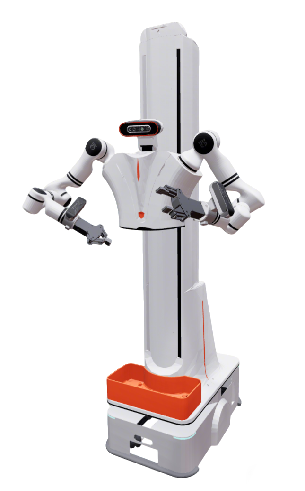

# Realman AIDAL Description

This package contains the description files for Realman Aidal(**AI Dual Arm Lift**).

## 1. Build
```bash
cd ~/ros2_ws
colcon build --packages-up-to aidal_description --symlink-install
```

## 2. Visualize the robot

### 2.1 Full Robot

```bash
source ~/ros2_ws/install/setup.bash
ros2 launch robot_common_launch manipulator.launch.py robot:=aidal
```

```bash
source ~/ros2_ws/install/setup.bash
ros2 launch robot_common_launch manipulator.launch.py robot:=aidal type:=eg2-4c2
```


### 2.2 Component

```bash
source ~/ros2_ws/install/setup.bash
ros2 launch robot_common_launch component.launch.py robot:=aidal
```

```bash
source ~/ros2_ws/install/setup.bash
ros2 launch robot_common_launch component.launch.py robot:=aidal type:=body
```

## 3. OCS2 Demo

### 3.1 Official OCS2 Mobile Manipulator Demo

```bash
source ~/ros2_ws/install/setup.bash
ros2 launch robot_common_launch manipulator_ocs2.launch.py robot_name:=aidal
```

### 3.2 Mock Component

```bash
source ~/ros2_ws/install/setup.bash
ros2 launch ocs2_arm_controller demo.launch.py robot:=aidal
```

```bash
source ~/ros2_ws/install/setup.bash
ros2 launch ocs2_arm_controller demo.launch.py robot:=aidal type:=eg2-4c2
```

### 3.3 Isaac Sim

```bash
source ~/ros2_ws/install/setup.bash
ros2 launch ocs2_arm_controller demo.launch.py robot:=aidal hardware:=isaac
```

```bash
source ~/ros2_ws/install/setup.bash
ros2 launch ocs2_arm_controller demo.launch.py robot:=aidal hardware:=isaac type:=eg2-4c2
```

## 4. Navigation (Isaac Sim Ground Truth Odom)

```bash
source ~/ros2_ws/install/setup.bash
ros2 launch robot_common_launch navigation_isaac_gt.launch.py robot:=aidal
```