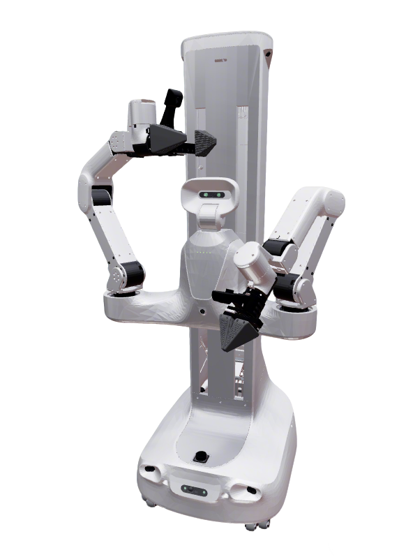

# X2Robot Quanta X1 Description

This package contains the URDF and configuration files for the XSquare Quanta X1 Robot.  The origin models could be found at [XSquare Robot SDK](https://github.com/X-Square-Robot/sdk_robot).

## 1. Build

```bash
cd ~/ros2_ws
colcon build --packages-up-to quanta_x1_description --symlink-install
```

## 2. Visualize the robot
### 2.1 Full Robot
* Quanta X1 (Basic visualization)
```bash
source ~/ros2_ws/install/setup.bash
ros2 launch robot_common_launch manipulator.launch.py robot:=quanta_x1
```



### 2.2 Component
* Base
  ```bash
  source ~/ros2_ws/install/setup.bash
  ros2 launch robot_common_launch component.launch.py robot:=quanta_x1 type:=base
  ```
* Single arm
  ```bash
  source ~/ros2_ws/install/setup.bash
  ros2 launch robot_common_launch component.launch.py robot:=quanta_x1 type:=arm
  ```